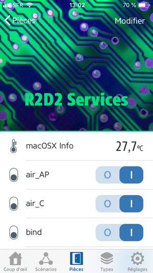
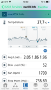

# homebridge-macosx-info
[](https://www.npmjs.com/package/homebridge-macosx-info) 
[](https://www.npmjs.com/package/homebridge-macosx-info)
[](https://standardjs.com) 
[](https://github.com/ad5030/homebridge-macosx-info)
[](https://github.com/ad5030/homebridge-macosx-info)

*See [changelog](docs/CHANGELOG.md)*

homebridge-macosx-info is homebridge plugin for Apple HomeKit, get and return somes systems informations from macOSX computer. 

Such as :
* updateTime
* Temperature (C°)
* Fan speed (rpm)
* Uptime
  * show how long system has been running
* Load average (%) 
  * the load average of the system over the last 1, 5, and 15 minute
* Free Mem (Mo)
* Disk avalable (%)


You can see below two screenshots for illustrate homebridge-macos-info homebridge/HomeKit plugin.





## Exemple of .json data response file
```json  
{
    "updateTime":"Sun Apr 21 22:38:07 CEST 2019",
    "temperature":30.7,
    "fan":1801,
    "uptime":"up 16:38, 2 users",
    "load":"3.15 1.97 1.82",
    "freemem":422.35,
    "disk":50
}
```
## Prerequisites
* Install [Homebrew](https://brew.sh)<span style="color:gray"> *(Homebrew installs the stuff you need that Apple didn’t)*</span>
* Install [Homebridge](https://github.com/nfarina/homebridge/wiki/Install-Homebridge-on-macOS) on macOS
* Install [Homebridge Config UI X](https://github.com/oznu/homebridge-config-ui-x#readme) on macOS <span style="color:gray">*(optional)</span>*
* Install [node.js](https://nodejs.org/en/download/package-manager/#macos) on macOS
* Install [check_osx_smc](https://github.com/jedda/OSX-Monitoring-Tools/tree/master/check_osx_smc) on macOS
* Install [Eve.app](https://www.evehome.com/en/eve-app) on iOS (for all availables plugin function), or it's possible to used "Home" app, but only on macOSX Majave and iOS (all plugin function aren't availables on this app !)

## Installation
Used [npm](https://www.npmjs.com/package/homebridge-macosx-info) tool to install homebridge-macosx-info, and execute the command line below

```npm i homebridge-macosx-info```

## Configuration
### STEP 1 : homebridge config.json file
Add this lines in config.json
```json    
"accessories": [
        {
            "accessory": "MacOSXSysInfo",
            "name": "macOSX Info",
            "file": "/tmp/_homebridge-macosx-info.json",
            "updateInterval": 60000
        }
    ],
```

| Parameter       | Note | Optionnal | value | 
|-----------------|------|-----------|-------|
| `accessory`     | Name of accessory|No|`MacOSXSysInfo`|
| `name`          | a human-readable name for your plugin|No|`macOSX Info`|
| `file`          | .json respons file|yes|default : `/tmp/_homebridge-macosx-info.json`|
| `updateInterval`| is time in ms of data update|yes|default : `null`|

_Note:_ 
1. The `index.js` call *`<PATH of Node Module>/homebridge-macosx-info/sh/homebridge-macosx-info.sh`* shell script. You can find this script in the repository in `/src/sh` directory
2. It's possible that you can change the path of `homebridge-macosx-info.sh` shell script in `index.js`
```js
var script = exec('/usr/local/lib/node_modules/homebridge-macosx-info/src/sh/homebridge-macosx-info.sh',
		(error, stdout, stderr) => {
			if (error !== null) {
				//this.log("exec error: " + ${error});
			}
		});		 
```
### STEP 2 : homebridge config.json file Adapte "homebridge-macosx-info.sh" file in "src/sh" directory
1. Change or adapte path of temporary .json files -> `var JSON_DATA_FILE`
2. Change or adapte path of [`check_osx_smc`](https://github.com/jedda/OSX-Monitoring-Tools/tree/master/check_osx_smc) binary -> `var CHECK_OSX_SMC`

```sh
JSON_DATA_FILE=/tmp/_homebridge-macosx-info.json
CHECK_OSX_SMC=~/r2d2/it/script/check_osx_smc

function sys_mon()
{
_time=`date`

# See the hardware compatibility -> https://github.com/jedda/OSX-Monitoring-Tools/blob/master/check_osx_smc/known-registers.md
read -a fields <<< `$CHECK_OSX_SMC -s c -r TA0P,F0Ac -w 70,5200 -c 85,5800`
_temp=${fields[7]//,/.}
_fan=${fields[8]}

IFS=' ' read -ra STR <<< `uptime`   
_uptime="${STR[1]} ${STR[2]} ${STR[3]} ${STR[4]//,/}"

_load=`sysctl -n vm.loadavg` 
_load="${_load//[\{\}]}"
_load="${_load/ /}"
_load="${_load%?}"

read -a fields <<< `vm_stat | perl -ne '/page size of (\d+)/ and $size=$1; /Pages\s+([^:]+)[^\d]+(\d+)/ and printf("%-16s % 16.2f Mi\n", "$1:", $2 * $size / 1048576)' | grep "free:"`
_freemem=${fields[1]}

read -a fields <<<  `df -h / | grep /`
_disk=${fields[4]//%/}

echo '{"updateTime":"'${_time}'","temperature":'${_temp:5:4}',"fan":'${_fan:5:4}',"uptime":"'${_uptime}'","load":"'${_load}'","freemem":'${_freemem:0:6}',"disk":'${_disk}'}' > $JSON_DATA_FILE
}
```

### STEP 3 : restart homebridge 
Combine the two commands in a terminal to restart homebridge background process

 - `launchctl unload ~/Library/LaunchAgents/com.homebridge.server.plist`
 - `launchctl load ~/Library/LaunchAgents/com.homebridge.server.plist`

_Note:_ 
Commands only avalable for macOS 

## Todo
- [x] Generate all the measures in a .json file
- [ ] Worked on performance
  - [x] Use only sh built-in (no sed & no awk) 


## Known bugs
- [x] Uptime error in "homebridge-macosx-info" after more than one day ! 
- [x] Temparature and fan mesures don't work on all Apple mac hardware. Used now [`check_osx_smc`](https://github.com/jedda/OSX-Monitoring-Tools/tree/master/check_osx_smc) binary. You can see the hardware compatibility [here](https://github.com/jedda/OSX-Monitoring-Tools/blob/master/check_osx_smc/known-registers.md)  

## Credits
* The original HomeKit API work was done by [KhaosT](https://twitter.com/khaost) in his [HAP-NodeJS](https://github.com/KhaosT/HAP-NodeJS) project
* [simont77 - fakegato-history](https://github.com/simont77/fakegato-history)
* [Jedda Wignall - OSX-Monitoring-Tools/check_osx_smc](https://github.com/jedda/OSX-Monitoring-Tools/tree/master/check_osx_smc)


## Disclaimer
I'm furnishing this software "as is". I do not provide any warranty of the item whatsoever, whether express, implied, or statutory, including, but not limited to, any warranty of merchantability or fitness for a particular purpose or any warranty that the contents of the item will be error-free. The development of this module is not supported by Apple Inc. or eve. These vendors and me are not responsible for direct, indirect, incidental or consequential damages resulting from any defect, error or failure to perform.

## License
This project is licensed under the MIT License - see the [LICENSE](LICENSE) file for details